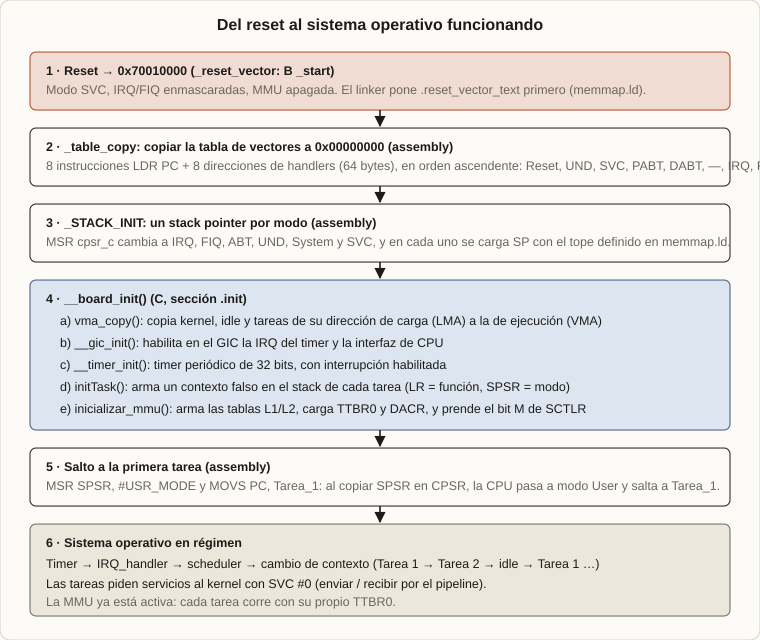
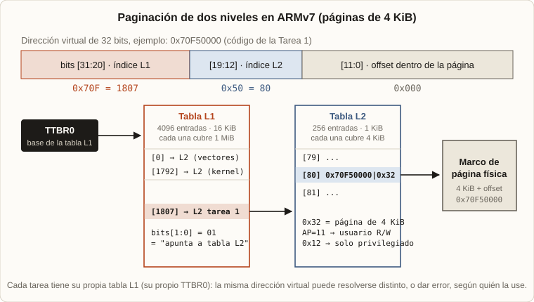
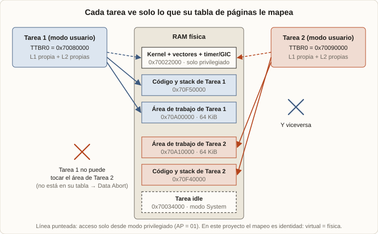
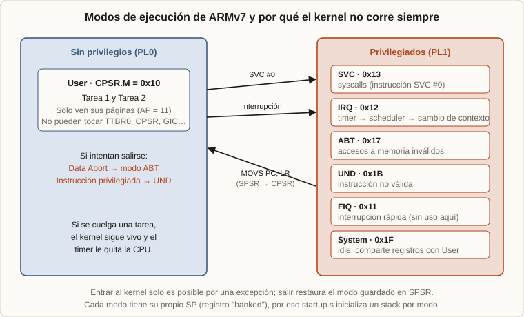
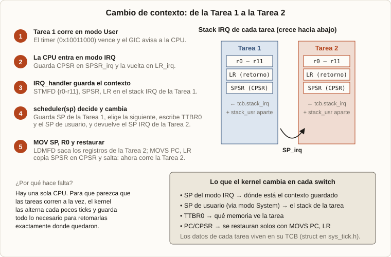

# Sistem-Operativo-ByNico

Un mini sistema operativo *bare-metal* para **ARM Cortex-A8**, escrito en C y Assembly, que corre en **QEMU** (placa `realview-pb-a8`).

El objetivo es entender lo que casi siempre se da por hecho: cómo un sistema consigue que **la memoria funcione** y que **varios programas corran a la vez** sobre una sola CPU. Para eso implementa a mano memoria virtual, niveles de privilegio, interrupciones, syscalls y cambio de contexto.

Proyecto de la materia Técnicas Digitales III (UTN FRBA), 2025.
La explicación completa, paso a paso, está en la nota del portfolio de Nicolás Pereyra Pigerl.

## Qué hace

- **Tres tareas:** `Tarea_1`, `Tarea_2` e `idle` (espera con `wfi`).
- **Scheduler round-robin** disparado por el timer (SP804 de la placa) a través del GIC.
- **Paginación de dos niveles** (tablas L1 y L2, páginas de 4 KiB) con un `TTBR0` por tarea. Cada tarea solo ve sus páginas.
- **Permisos por página:** kernel, vectores, timer, GIC y stacks IRQ son solo-privilegiado (`AP=01`); código, datos y stack de usuario son accesibles desde modo usuario (`AP=11`).
- **Modos de ARM:** las tareas corren en User; el kernel en IRQ, SVC y System.
- **Syscalls** con `SVC #0` y un *pipeline* (cola circular) para que las tareas se pasen datos.

Qué hacen las tareas: `Tarea_1` recorre su área de memoria alternando `0x55AA55AA` / `0xAA55AA55` y envía el índice por syscall; `Tarea_2` lo recibe y lo guarda en su propia área (o invierte el valor si no llegó nada).

> El mapeo actual es de identidad (dirección virtual = física). Lo que cambia entre tareas es qué páginas existen en cada tabla y con qué permisos.

## Estructura

| Ruta | Contenido |
|---|---|
| `core/` | Assembly: vector de reset, tabla de vectores, inicialización de stacks por modo, handlers de excepciones |
| `proc/` | C: inicialización de placa, GIC, timer, MMU/paginación, atención de IRQ |
| `sys/` | C: scheduler, TCB, cambio de SP por modo, syscalls y pipeline |
| `kernel/` | Tareas (`tarea_1.c`, `tarea_2.c`) y tarea idle (`tarea_4.c`) |
| `inc/` | Headers |
| `memmap.ld` | Linker script: mapa de memoria, secciones LMA/VMA, stacks y tablas de páginas |
| `docs/img/` | Diagramas |

## Cómo compilar y correr

Necesitás `make`, el toolchain `arm-none-eabi-gcc` y `qemu-system-arm`.

```bash
make          # compila y linkea → bin/ejer3.bin
make run      # ejecuta en QEMU (Ctrl+A luego X para salir)
make debug    # QEMU en pausa, esperando GDB en el puerto 2159
make clean
```

## Cómo funciona

### Arranque


1. Reset en `0x70010000` (`B _start`).
2. Se copia la tabla de vectores a `0x00000000`.
3. Se inicializa un SP por cada modo.
4. `__board_init()`: copia LMA→VMA, inicializa GIC y timer, prepara los contextos iniciales y enciende la MMU.
5. `MOVS PC, Tarea_1` con `SPSR = User`: entra en modo usuario y arranca la primera tarea.

### Paginación


`TTBR0` apunta a la tabla L1 (4096 entradas, 16 KiB, alineada a 16 KiB). Cada entrada L1 apunta a una tabla L2 (256 entradas, 1 KiB). La dirección virtual se divide en `[31:20]` índice L1, `[19:12]` índice L2 y `[11:0]` offset. La lógica está en `paginacion()` (`proc/mmu.c`).

### Aislamiento entre tareas


### Modos de privilegio


### Cambio de contexto


El handler de IRQ apila `r0–r11`, `SPSR` y `LR` en el stack IRQ de la tarea actual, el scheduler devuelve el SP de la tarea siguiente (y cambia `TTBR0` y el SP de usuario) y `MOVS PC, LR` retoma la nueva tarea. `initTask()` fabrica un contexto inicial para cada tarea.

## Simulación y depuración

El sistema corre en una **simulación de un microprocesador Cortex-A8** dentro de la computadora, usando QEMU. Para depurarlo se usó **GDB** con la interfaz gráfica **DDD**:

```bash
make debug
ddd --debugger gdb-multiarch obj/ejer3.elf
```

Desde DDD se ejecuta paso a paso, se ponen breakpoints y se inspeccionan registros (`CPSR`, `SP` por modo, `TTBR0`) y memoria.
