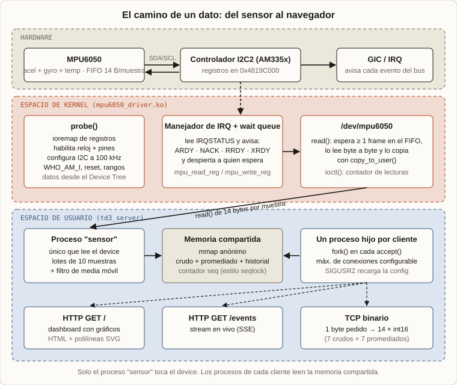
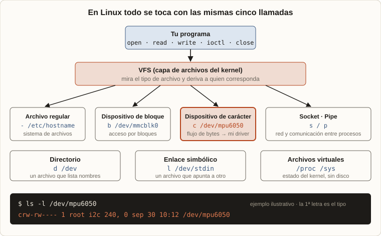

# Driver de Linux para el MPU6050 en BeagleBone Black

Driver de kernel de Linux para leer un sensor **MPU6050** (acelerómetro, giroscopio y temperatura) en una **BeagleBone Black** (AM335x, Cortex-A8), más un servidor TCP que publica los datos.

A diferencia de un driver I²C típico (que usa la API `i2c_client` del kernel), este driver se registra como *platform driver* y **maneja el controlador I2C2 directamente**: registros por MMIO, reloj, pines e interrupciones. El objetivo era entender qué hay debajo de esa abstracción y qué exige integrar un periférico en un sistema grande y ya existente.

Explicación completa en la nota del portfolio de Nicolás Pereyra Pigerl.

## Qué incluye

| Ruta | Contenido |
|---|---|
| `scr/mpu6050_driver.c` | Módulo de kernel: probe, IRQ, transferencias I²C, FIFO, char device `/dev/mpu6050`, ioctl |
| `inc/` | Constantes del sensor (`mpu6050.h`), registros del SoC (`ti_bb.h`), estructuras (`extras.h`), ioctls compartidos (`mpu6050_ioctl.h`) |
| `mpu6050_npp.dts` | Device Tree Overlay que asigna el controlador I2C2 a este driver y pasa la configuración |
| `test/mpu6050_test.c` | Programa de prueba en espacio de usuario |
| `test/server/` | Servidor TCP concurrente (dashboard web, stream y protocolo binario) con filtro de media móvil |
| `test/server/NEON_analysis.md` | Análisis de las instrucciones NEON que genera el compilador para el filtro |
| `docs/img/` | Diagramas |

## Cómo funciona



### Driver
- **Device Tree:** el overlay reemplaza el `compatible` del nodo I2C2 por `i2c_mpu6050`, de modo que el driver estándar del kernel deja de manejarlo. También pasa la configuración del sensor: frecuencia de muestreo, filtro digital y rangos del giroscopio y el acelerómetro.
- **`probe()`:** mapea con `ioremap` los registros del reloj (`CM_PER_I2C2_CLKCTRL`), del multiplexado de pines (`CONTROL_MODULE_CONF_I2C2_*`) y del controlador I2C2; pide la interrupción; habilita el reloj y espera a que el módulo esté funcional; configura I²C a 100 kHz; verifica el sensor con `WHO_AM_I` (`0x68`, con reintento en `0x69`) y lo resetea.
- **Transferencias:** cada lectura o escritura de registro arma la transacción en el controlador y duerme en una *wait queue* hasta que el manejador de interrupciones (`ARDY`, `NACK`, `RRDY`, `XRDY`, bus libre) la completa, con timeout.
- **`read()`:** usa el FIFO interno del sensor (aceleración + temperatura + giroscopio = frames de 14 bytes). Espera a que haya al menos un frame (por interrupción de datos listos si el pin INT está conectado a un GPIO, o por espera corta si no), detecta desbordes y conserva el sobrante para mantener la alineación de frames.
- **`open()`:** exclusivo (semáforo). **`ioctl`:** contador de lecturas exitosas desde que se cargó el módulo.

### En Linux todo es un archivo



El sensor queda disponible como un dispositivo de carácter (`/dev/mpu6050`). Desde espacio de usuario se lo usa con `open`, `read`, `ioctl` y `close`, como cualquier otro archivo. El VFS deriva cada llamada al driver a través de su estructura `file_operations`.

### Servidor
- Proceso padre: acepta clientes y hace `fork()` por cada uno, con un máximo de conexiones activas.
- Proceso "sensor": único lector del dispositivo. Lee lotes de 10 muestras, aplica un filtro de media móvil centrada (`filter.c`, compilado con `-Ofast`) y publica muestras crudas y promediadas en memoria compartida (`mmap`) con un contador de secuencia estilo *seqlock*.
- Procesos de cliente: leen la memoria compartida.
  - `GET /`: página con valores actuales y gráficos SVG del historial.
  - `GET /events`: stream en vivo (Server-Sent Events).
  - TCP binario: por cada byte recibido responde 14 enteros de 16 bits (7 canales crudos + 7 promediados).
- Configuración (`server.conf`, tres líneas): máximo de conexiones, backlog y ventana del filtro. `SIGUSR2` recarga el máximo de conexiones y la ventana sin reiniciar.

## Dónde va cada archivo y qué modifica

| Archivo | Destino | Efecto |
|---|---|---|
| `scr/mpu6050_driver.c` | `.ko` → `/lib/modules/<versión>/extra/` (+ `depmod -a`) | Agrega código al kernel en ejecución: crea el char device, registra el platform driver, pide la IRQ y mapea registros |
| `mpu6050_npp.dts` | `.dtbo` → `/lib/firmware/` | Modifica el Device Tree: el nodo `i2c@0` de I2C2 pasa a `compatible = "i2c_mpu6050"` para que lo tome este driver |
| `inc/ti_bb.h` | Solo compilación | Direcciones y registros del AM335x (reloj, pines, controlador I2C2) |
| `inc/mpu6050.h` | Solo compilación | Mapa de registros y direcciones del sensor |
| `inc/mpu6050_ioctl.h` | Kernel **y** usuario | Contrato de los `ioctl`; se compila en ambos lados |
| `test/mpu6050_test.c`, `test/server/` | Binarios locales | No modifican el sistema; leen `/dev/mpu6050` |

Sin haberlos escrito, el driver hace aparecer `/dev/mpu6050` (vía `device_create()` y udev) y `/sys/class/i2cMpu6050/`. Como el overlay asigna el nodo I2C2 a este driver, ese bus deja de estar disponible para otros dispositivos I²C mientras el overlay esté activo.

## Tipo de dispositivo: char device

`/dev/mpu6050` es un **dispositivo de carácter**: un flujo de bytes (muestras del sensor) que atiende directamente el driver. Se crea con `alloc_chrdev_region()`, `cdev_init()`/`cdev_add()` y `class_create()`/`device_create()`. Los otros tipos son los **de bloque** (almacenamiento con acceso aleatorio y caché, como `/dev/mmcblk0`) y los **de red** (paquetes, sin nodo en `/dev`). El kernel ya incluye un driver para este sensor en el subsistema IIO (`inv_mpu6050`); este proyecto lo reescribe a mano para entender cada capa.

## Compilar y probar

Todo se compila **en la BeagleBone**, contra los headers de su kernel (`/lib/modules/$(uname -r)/build`). Necesita `build-essential`, los headers del kernel y `dtc`.

```bash
make bin          # compila el módulo → bin/mpu6050_driver.ko
make dtbo         # compila el overlay con dtc
make dtbo_install # copia el .dtbo a /lib/firmware
make reload       # descarga, instala y carga el módulo
make follow       # dmesg -w filtrando por [mpu6050]
make test         # programa de prueba (TEST_FRAMES / TEST_DELAY_MS)
```

Servidor:

```bash
cd test/server
make
./td3_server -b 0.0.0.0 -p 8080 -d /dev/mpu6050 -c server.conf
kill -USR2 $(pidof td3_server)      # recarga la configuración
```

Con el servidor corriendo, abrí `http://<ip-de-la-placa>:8080` desde otra computadora.

## Conexión

| MPU6050 | BeagleBone Black |
|---|---|
| SDA | P9_20 (I2C2_SDA) |
| SCL | P9_19 (I2C2_SCL) |
| VCC / GND | 3,3 V / GND |
| INT (opcional) | Un GPIO, descripto como `drdy-gpios` en el overlay |
